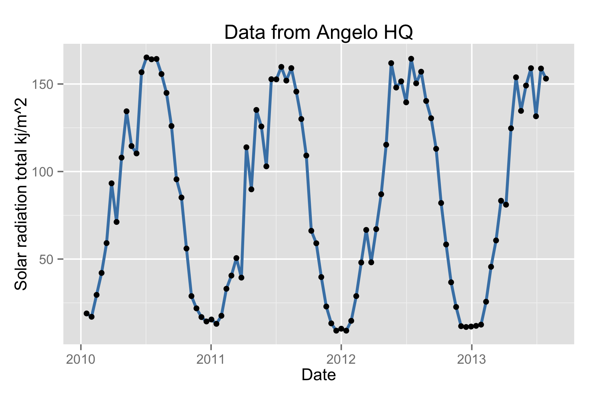

# Guide to using the ecoengine R package


The Berkeley Ecoengine ([http://ecoengine.berkeley.edu](http://ecoengine.berkeley.edu)) provides an open API to a wealth of museum data contained in the [Berkeley natural history museums](https://bnhm.berkeley.edu/). This R package provides a programmatic interface to this rich repository of data allowing for the data to be easily analyzed and visualized or brought to bear in other contexts. This vignette provides a brief overview of the package's capabilities. 

The API documentation is available at [http://ecoengine.berkeley.edu/developers/](http://ecoengine.berkeley.edu/developers/). As with most APIs it is possible to query all the available endpoints that are accessible through the API itself. Ecoengine has something similar.


```r
library(ecoengine)
ee_about()
```


----------------------------------
type                              
----------------------------------
wieslander_vegetation_type_mapping

wieslander_vegetation_type_mapping

wieslander_vegetation_type_mapping

wieslander_vegetation_type_mapping

data                              

data                              

data                              

data                              

actions                           

meta-data                         

meta-data                         
----------------------------------

Table: Table continues below

 
----------------------------------------------------
endpoint                                            
----------------------------------------------------
https://ecoengine.berkeley.edu/api/vtmplots_trees/  

https://ecoengine.berkeley.edu/api/vtmplots/        

https://ecoengine.berkeley.edu/api/vtmplots_brushes/

https://ecoengine.berkeley.edu/api/vtmveg/          

https://ecoengine.berkeley.edu/api/checklists/      

https://ecoengine.berkeley.edu/api/sensors/         

https://ecoengine.berkeley.edu/api/observations/    

https://ecoengine.berkeley.edu/api/photos/          

https://ecoengine.berkeley.edu/api/search/          

https://ecoengine.berkeley.edu/api/footprints/      

https://ecoengine.berkeley.edu/api/sources/         
----------------------------------------------------

## The ecoengine class

The data functions in the package include ones that query obervations, checklists, photos, vegetation records, and a variety of measurements from sensors. These data are all formatted as a common `S3` class called `ecoengine`. The class includes 4 slots.

- [`Total results on server`] A total result count (not necessarily the results in this particular object but the total number available for a particlar query)
- [`Args`] The arguments  (So a reader can replicate the results or rerun the query using other tools.)  
- [`Type`] The type (`photos`, `observation`, `checklist`, or `sensor`)  
- [`Number of results retrieved`] The data. Data are most often coerced into a `data.frame`. To access the data simply use `result_object$data`.  

The default `print` method for the class will summarize the object.

## Notes on downloading large data requests

For the sake of speed, results are paginated at `1000` results per page. It is possible to request all pages for any query by specifying `page = all` in any function that retrieves data. However, this option should be used if the request is reasonably sized. With larger requests, there is a chance that the query might become interrupted and you could lose any data that may have been partially downloaded. In such cases the recommended practice is to use the returned observations to split the request. You can always check the number of requests you'll need to retreive data for any query by running `ee_pages(obj)` where `obj` is an object of class `ecoengine`.


```r
request <- ee_photos(county = "Santa Clara County", quiet = TRUE, progress = FALSE)
# Use quiet to suppress messages. Use progress = FALSE to suppress progress
# bars which can clutter up documents.
ee_pages(request)
```

```
#>  [1] 1
```

```r
# Now it's simple to parallelize this request You can parallelize across
# number of cores by passing a vector of pages from 1 through the total
# available.
```


### Specimen Observations


The database contains over 2 million records (2861286 total). Many of these have already been georeferenced. There are two ways to obtain observations. One is to query the database directly based on a partial or exact taxonomic match. For example


```r
pinus_observations <- ee_observations(scientific_name = "Pinus", page = 1, quiet = TRUE, 
    progress = FALSE)
pinus_observations
```

```
#>  [Total results on the server]: 43363 
#>  [Args]: 
#>  country = United States 
#>  scientific_name = Pinus 
#>  georeferenced = FALSE 
#>  page_size = 1000 
#>  page = 1 
#>  [Type]: FeatureCollection 
#>  [Number of results retrieved]: 1000
```

For additional fields upon which to query, simply look through the help for `?ee_observations`. In addition to narrowing data by taxonomic group, it's also possible to add a bounding box (add argument `bbox`) or request only data that have been georeferenced (set `georeferenced = TRUE`). 


```r
lynx_data <- ee_observations(genus = "Lynx", georeferenced = TRUE, quiet = TRUE, 
    progress = FALSE)
lynx_data
```

```
#>  [Total results on the server]: 701 
#>  [Args]: 
#>  country = United States 
#>  genus = Lynx 
#>  georeferenced = True 
#>  page_size = 1000 
#>  page = 1 
#>  [Type]: FeatureCollection 
#>  [Number of results retrieved]: 701
```

```r
# Notice that we only for the first 1000 rows.  But since 795 is not a big
# request, we can obtain this all in one go.
lynx_data <- ee_observations(genus = "Lynx", georeferenced = TRUE, page = "all", 
    progress = FALSE)
```

```
#>  Search contains 701 observations (downloading 1 of 1 pages)
```

```r
lynx_data
```

```
#>  [Total results on the server]: 701 
#>  [Args]: 
#>  country = United States 
#>  genus = Lynx 
#>  georeferenced = True 
#>  page_size = 1000 
#>  page = all 
#>  [Type]: FeatureCollection 
#>  [Number of results retrieved]: 701
```

__Other search examples__


```r
animalia <- ee_observations(kingdom = "Animalia")
Artemisia <- ee_observations(scientific_name = "Artemisia douglasiana")
asteraceae <- ee_observationss(family = "asteraceae")
vulpes <- ee_observations(genus = "vulpes")
Anas <- ee_observations(scientific_name = "Anas cyanoptera", page = "all")
loons <- ee_observations(scientific_name = "Gavia immer", page = "all")
plantae <- ee_observations(kingdom = "plantae")
# grab first 10 pages (250 results)
plantae <- ee_observations(kingdom = "plantae", page = 1:10)
chordata <- ee_observations(phylum = "chordata")
# Class is clss since the former is a reserved keyword in SQL.
aves <- ee_observations(clss = "aves")
```

__Additional Features__

As of July 2014, the API now allows you exclude or request additional fields from the database, even if they are not directly exposed by the API. 

_To request additional fields_


```r
aves <- ee_observations(clss = "aves", extra = "kingdom,genus")
```

```
#>  Search contains 170263 observations (downloading 1 of 171 pages)
```

```
#>  
  |                                                                       
  |                                                                 |   0%
  |                                                                       
  |=================================================================| 100%
```

```r
names(aves$data)
```

```
#>   [1] "longitude"        "latitude"         "type"            
#>   [4] "url"              "observation_type" "scientific_name" 
#>   [7] "country"          "state_province"   "begin_date"      
#>  [10] "end_date"         "source"           "remote_resource" 
#>  [13] "kingdom"          "genus"
```

```r
aves <- ee_observations(clss = "aves", exclude = "source,remote_resource")
```

```
#>  Search contains 170263 observations (downloading 1 of 171 pages)
```

```
#>  
  |                                                                       
  |                                                                 |   0%
  |                                                                       
  |=================================================================| 100%
```

```r
names(aves$data)
```

```
#>   [1] "longitude"        "latitude"         "type"            
#>   [4] "url"              "observation_type" "scientific_name" 
#>   [7] "country"          "state_province"   "begin_date"      
#>  [10] "end_date"
```


__Mapping observations__

The development version of the package includes a new function `ee_map()` that allows users to generate interactive maps from observation queries using Leaflet.js. 


```r
lynx_data <- ee_observations(genus = "Lynx", georeferenced = TRUE, page = "all", 
    quiet = TRUE)
ee_map(lynx_data)
```


### Photos  

The ecoengine also contains a large number of photos from various sources. It's easy to query the photo database using similar arguments as above. One can search by taxa, location, source, collection and much more.


```r
photos <- ee_photos(quiet = TRUE, progress = FALSE)
photos
```

```
#>  [Total results on the server]: 60863 
#>  [Args]: 
#>  page_size = 1000 
#>  georeferenced = 0 
#>  page = 1 
#>  [Type]: photos 
#>  [Number of results retrieved]: 1000
```
The database currently holds 60863 photos. Photos can be searched by state province, county, genus, scientific name, authors along with date bounds. For additional options see `?ee_photos`.


#### Searching photos by author


```r
charles_results <- ee_photos(author = "Charles Webber", quiet = TRUE, progress = FALSE)
charles_results
```

```
#>  [Total results on the server]: 3656 
#>  [Args]: 
#>  page_size = 1000 
#>  authors = Charles Webber 
#>  georeferenced = FALSE 
#>  page = 1 
#>  [Type]: photos 
#>  [Number of results retrieved]: 1000
```

```r
# Let's examine a couple of rows of the data
charles_results$data[1:2, ]
```

```
#>           authors                               locality          county
#>  1 Charles Webber    Yosemite National Park, Badger Pass Mariposa County
#>  2 Charles Webber Yosemite National Park, Yosemite Falls Mariposa County
#>    photog_notes
#>  1      Tan Oak
#>  2         <NA>
#>                                                                                 url
#>  1 https://ecoengine.berkeley.edu/api/photos/CalPhotos%3A8076%2B3101%2B2933%2B0025/
#>  2 https://ecoengine.berkeley.edu/api/photos/CalPhotos%3A8076%2B3101%2B0667%2B0107/
#>    begin_date end_date geojson.type   longitude  latitude
#>  1       <NA>     <NA>        Point -119.657387 37.663724
#>  2       <NA>     <NA>        Point -119.597389 37.753851
#>                           record
#>  1 CalPhotos:8076+3101+2933+0025
#>  2 CalPhotos:8076+3101+0667+0107
#>                                                    remote_resource
#>  1 http://calphotos.berkeley.edu/cgi/img_query?seq_num=21272&one=T
#>  2 http://calphotos.berkeley.edu/cgi/img_query?seq_num=14468&one=T
#>    collection_code              scientific_name
#>  1      CalAcademy Notholithocarpus densiflorus
#>  2      CalAcademy     Rhododendron occidentale
#>                                                                                           url
#>  1 https://ecoengine.berkeley.edu/api/observations/CalPhotos%3A8076%2B3101%2B2933%2B0025%3A1/
#>  2 https://ecoengine.berkeley.edu/api/observations/CalPhotos%3A8076%2B3101%2B0667%2B0107%3A1/
#>                                                              media_url
#>  1 http://calphotos.berkeley.edu/imgs/512x768/8076_3101/2933/0025.jpeg
#>  2 http://calphotos.berkeley.edu/imgs/512x768/8076_3101/0667/0107.jpeg
#>                                           source
#>  1 https://ecoengine.berkeley.edu/api/sources/9/
#>  2 https://ecoengine.berkeley.edu/api/sources/9/
```
---  

#### Browsing these photos


```r
view_photos(charles_results)
```
This will launch your default browser and render a page with thumbnails of all images returned by the search query. You can do this with any `ecoengine` object of type `photos`. Suggestions for improving the photo browser are welcome.


Other photo search examples


```r
# All the photos in the CDGA collection
all_cdfa <- ee_photos(collection_code = "CDFA", page = "all", progress = FALSE)
# All Racoon pictures
racoons <- ee_photos(scientific_name = "Procyon lotor", quiet = TRUE, progress = FALSE)
```

---  


### Species checklists

There is a wealth of checklists from all the source locations. To get all available checklists from the engine, run: 
  

```r
all_lists <- ee_checklists()
```

```
#>  Returning 52 checklists
```

```r
head(all_lists[, c("footprint", "subject")])
```

```
#>                                                          footprint
#>  1   https://ecoengine.berkeley.edu/api/footprints/angelo-reserve/
#>  2   https://ecoengine.berkeley.edu/api/footprints/angelo-reserve/
#>  3   https://ecoengine.berkeley.edu/api/footprints/angelo-reserve/
#>  4 https://ecoengine.berkeley.edu/api/footprints/hastings-reserve/
#>  5   https://ecoengine.berkeley.edu/api/footprints/angelo-reserve/
#>  6 https://ecoengine.berkeley.edu/api/footprints/hastings-reserve/
#>       subject
#>  1    Mammals
#>  2     Mosses
#>  3    Beetles
#>  4    Spiders
#>  5 Amphibians
#>  6       Ants
```
Currently there are 52 lists available. We can drill deeper into any list to get all the available data. We can also narrow our checklist search to groups of interest (see `unique(all_lists$subject)`). For example, to get the list of Spiders:


```r
spiders <- ee_checklists(subject = "Spiders")
```

```
#>  Returning 1 checklists
```

```r
spiders
```

```
#>                  record
#>  4 bigcb:specieslist:15
#>                                                          footprint
#>  4 https://ecoengine.berkeley.edu/api/footprints/hastings-reserve/
#>                                                                        url
#>  4 https://ecoengine.berkeley.edu/api/checklists/bigcb%3Aspecieslist%3A15/
#>                                            source subject
#>  4 https://ecoengine.berkeley.edu/api/sources/18/ Spiders
```

Now we can drill deep into each list. For this tutorial I'll just retrieve data from the the two lists returned above.


```r
library(plyr)
spider_details <- ldply(spiders$url, checklist_details)
names(spider_details)
```

```
#>   [1] "url"                              "observation_type"                
#>   [3] "scientific_name"                  "collection_code"                 
#>   [5] "institution_code"                 "country"                         
#>   [7] "state_province"                   "county"                          
#>   [9] "locality"                         "begin_date"                      
#>  [11] "end_date"                         "kingdom"                         
#>  [13] "phylum"                           "clss"                            
#>  [15] "order"                            "family"                          
#>  [17] "genus"                            "specific_epithet"                
#>  [19] "infraspecific_epithet"            "source"                          
#>  [21] "remote_resource"                  "earliest_period_or_lowest_system"
#>  [23] "latest_period_or_highest_system"
```

```r
unique(spider_details$scientific_name)
```

```
#>   [1] "Holocnemus pluchei"        "Oecobius navus"           
#>   [3] "Uloborus diversus"         "Neriene litigiosa"        
#>   [5] "Theridion "                "Tidarren "                
#>   [7] "Dictyna "                  "Mallos "                  
#>   [9] "Yorima "                   "Hahnia sanjuanensis"      
#>  [11] "Cybaeus "                  "Zanomys "                 
#>  [13] "Anachemmis "               "Titiotus "                
#>  [15] "Oxyopes scalaris"          "Zora hespera"             
#>  [17] "Drassinella "              "Phrurotimpus mateonus"    
#>  [19] "Scotinella "               "Castianeira luctifera"    
#>  [21] "Meriola californica"       "Drassyllus insularis"     
#>  [23] "Herpyllus propinquus"      "Micaria utahna"           
#>  [25] "Trachyzelotes lyonneti"    "Ebo evansae"              
#>  [27] "Habronattus oregonensis"   "Metaphidippus "           
#>  [29] "Platycryptus californicus" "Calymmaria "              
#>  [31] "Frontinella communis"      "Undetermined "            
#>  [33] "Latrodectus hesperus"
```

Our resulting dataset now contains 33 unique spider species. 


### Sensors

Sensor data come from the [Keck HydroWatch Center](http://nrs.ucop.edu/research/special_projects/Keck_HydroWatchl.htm). 

You'll need a sensor's id to query the data for that particular metric and location. The `ee_list_sensors()` function will give you a condensed list with the location, metric, binning method and most importantly the `sensor_id`. You'll need this id for the data retrieval. 


```r
head(ee_list_sensors())
```


-------------------------------------------------------------------
properties.station_name   properties.units   properties.variable   
------------------------- ------------------ ----------------------
Angelo Meadow WS          degree celcius     Air Temp C            

Cahto Peak WS             degree celcius     Air Temp C            

Angelo HQ WS              degree celcius     Air Temp C            

Angelo HQ SF Eel Gage     degree celcius     Air Temp C            

Angelo HQ WS              millibar           Barometric Pressure mb

Angelo Meadow WS          millibar           Barometric Pressure mb
-------------------------------------------------------------------

Table: List of stations (continued below)

 
---------------------------------
properties.method_name   record  
------------------------ --------
Conversion to 30-minute  1602    
timesteps                        

Conversion to 30-minute  1603    
timesteps                        

Conversion to 30-minute  1604    
timesteps                        

Conversion to 30-minute  1606    
timesteps                        

Conversion to 30-minute  1607    
timesteps                        

Conversion to 30-minute  1608    
timesteps                        
---------------------------------

Let's download solar radiation for the Angelo reserve HQ (sensor_id = `1625`).


```r
# First we can grab the list of sensor ids
sensor_ids <- ee_list_sensors()$record
# In this case we just need data for sensor with id 1625
angelo_hq <- sensor_ids[1]
results <- ee_sensor_data(angelo_hq, page = 2, progress = FALSE)
```

```
#>  Search contains 98527 records (downloading 1 page(s) of 99)
```

```r
results
```

```
#>  [Total results on the server]: 98527 
#>  [Args]: 
#>  page_size = 1000 
#>  sensor_id = 1602 
#>  page = 2 
#>  [Type]: sensor 
#>  [Number of results retrieved]: 1000
```

Notice that the query returned 98527 observations but has only retrieved the `25-50` since we requested records for page 2 (and each page by default retrieves `25` records). You can request `page = "all"` but remember that this will make 3941 requests. Now we can examine the data itself.


```r
head(results$data)
```

```
#>             local_date value
#>  1 2008-05-23 13:30:00 17.58
#>  2 2008-05-23 14:00:00 17.93
#>  3 2008-05-23 14:30:00 18.50
#>  4 2008-05-23 15:00:00 18.50
#>  5 2008-05-23 15:30:00 17.93
#>  6 2008-05-23 16:00:00 17.69
```

We can also aggregate sensor data for any of the above mentioned sensors. We do this using the `ee_sensor_agg()` function. The function requires a sensor id and how the data should be binned. You can specify hours, minutes, seconds, days, weeks, month, and years. If for example you need the data binned every `15` days, simply add `days = 15` to the call. Once every `10` days and `2` hours would be `ee_sensor_agg(sensor_id = 1625, days = 10, hours = 2)` 


```r
stations <- ee_list_sensors()
# This gives you a list to choose from
sensor_df <- ee_sensor_agg(sensor_id = stations[1, c("record")], weeks = 2, 
    progress = FALSE)
```

```
#>  Search contains 147 records (downloading 1 page(s) of 1)
```

```r
sensor_df
```

```
#>  [Total results on the server]: 147 
#>  [Args]: 
#>  page_size = 1000 
#>  interval = 2W 
#>  page = 1 
#>  [Type]: sensor 
#>  [Number of results retrieved]: 147
```

```r
head(sensor_df$data)
```

```
#>    begin_date  mean    min   max   sum count
#>  1 2008-05-11 10.80 -2.018 28.08  5888   545
#>  2 2008-05-25 15.45  2.823 36.11 10385   672
#>  3 2008-06-08 11.73  1.798 24.25  7880   672
#>  4 2008-06-22 17.45  3.506 33.85 11729   672
#>  5 2008-07-06 17.07  4.395 31.80 11474   672
#>  6 2008-07-20 20.73  6.787 40.72 13933   672
```

As with other functions, the results are paginated.  Since we only need `85` records in this case:


```r
sensor_df <- ee_sensor_agg(sensor_id = 1625, weeks = 2, page = "all", progress = FALSE)
```

```
#>  Search contains 94 records (downloading 1 page(s) of 1)
```

```r
sensor_df
```

```
#>  [Total results on the server]: 94 
#>  [Args]: 
#>  page_size = 1000 
#>  interval = 2W 
#>  page = all 
#>  [Type]: sensor 
#>  [Number of results retrieved]: 94
```


```r
library(ggplot2)
ggplot(sensor_df$data, aes(begin_date, mean)) + geom_line(size = 1, color = "steelblue") + 
    geom_point() + theme_gray() + ylab("Solar radiation total kj/m^2") + xlab("Date") + 
    ggtitle("Data from Angelo HQ")
```




### Searching the engine  

The search is elastic by default. One can search for any field in `ee_observations()` across all available resources. For example, 


```r
# The search function runs an automatic elastic search across all resources
# available through the engine.
lynx_results <- ee_search(query = "genus:Lynx")
lynx_results[, -3]
# This gives you a breakdown of what's available allowing you dig deeper.
```


------------------------------------
field                      results  
-------------------------- ---------
animalia                   712      

California                 469      

Nevada                     105      

Alaska                     82       

British Columbia           47       

Arizona                    36       

Baja California Sur        25       

Baja California            16       

New Mexico                 14       

Oregon                     13       

Zacatecas                  11       

mammalia                   898      

Observations               900      

felidae                    898      

Lynx rufus californicus    391      

Lynx canadensis canadensis 137      

Lynx rufus baileyi         135      

Lynx rufus pallescens      119      

Lynx rufus fasciatus       30       

Lynx rufus peninsularis    27       

Lynx rufus                 18       

Lynx rufus rufus           14       

Lynx rufus escuinapae      13       

Lynx rufus ssp.            4        

chordata                   900      

lynx                       900      

carnivora                  898      
------------------------------------

Similarly it's possible to search through the observations in a detailed manner as well.


```r
all_lynx_data <- ee_search_obs(query = "Lynx", page = "all", progress = FALSE)
```

```
#>  Search contains 992 observations (downloading 1 of 1 pages)
```

```r
all_lynx_data
```

```
#>  [Total results on the server]: 992 
#>  [Args]: 
#>  q = Lynx 
#>  page_size = 1000 
#>  page = all 
#>  [Type]: observations 
#>  [Number of results retrieved]: 992
```

---


### Miscellaneous functions

__Footprints__

`ee_footprints()` provides a list of all the footprints.


```r
footprints <- ee_footprints()
footprints[, -3]  # To keep the table from spilling over
```


----------------------
name                  
----------------------
Angelo Reserve        

Sagehen Reserve       

Hastings Reserve      

Blue Oak Ranch Reserve
----------------------

Table: Table continues below

 
---------------------------------------------------------------------
url                                                                  
---------------------------------------------------------------------
https://ecoengine.berkeley.edu/api/footprints/angelo-reserve/        

https://ecoengine.berkeley.edu/api/footprints/sagehen-reserve/       

https://ecoengine.berkeley.edu/api/footprints/hastings-reserve/      

https://ecoengine.berkeley.edu/api/footprints/blue-oak-ranch-reserve/
---------------------------------------------------------------------


__Data sources__

`ee_sources()` provides a list of data sources for the specimens contained in the museum.


```r
source_list <- ee_sources()
unique(source_list$name)
```


--------------------------
name                      
--------------------------
UCMP Vertebrate Collection

VTM plot data             

VTM plot coordinates      

BIGCB Sensors             

Consortium of California  
Herbaria                  

MVZ Mammals               

MVZ Mammals Observations  

VTM plot data trees       

VTM plot data brushes     

CAS Herpetology           
--------------------------


```r
sessionInfo()
```

```
#>  R version 3.1.0 (2014-04-10)
#>  Platform: x86_64-apple-darwin13.1.0 (64-bit)
#>  
#>  locale:
#>  [1] en_US.UTF-8/en_US.UTF-8/en_US.UTF-8/C/en_US.UTF-8/en_US.UTF-8
#>  
#>  attached base packages:
#>  [1] methods   stats     graphics  grDevices datasets  utils     base     
#>  
#>  other attached packages:
#>  [1] plyr_1.8.1         pander_0.3.8       ggplot2_1.0.0     
#>  [4] ecoengine_1.4.3.99 codetools_0.2-8    rmarkdown_0.2.49  
#>  [7] knitr_1.6          devtools_1.5      
#>  
#>  loaded via a namespace (and not attached):
#>   [1] assertthat_0.1    colorspace_1.2-4  coyote_0.1       
#>   [4] digest_0.6.4      dplyr_0.2         evaluate_0.5.5   
#>   [7] formatR_0.10      grid_3.1.0        gtable_0.1.2     
#>  [10] htmltools_0.2.6   httr_0.3.0.99     jsonlite_0.9.9   
#>  [13] labeling_0.2      leafletR_0.2-1    lubridate_1.3.3  
#>  [16] MASS_7.3-33       memoise_0.2.1     munsell_0.4.2    
#>  [19] parallel_3.1.0    proto_0.3-10      Rcpp_0.11.2      
#>  [22] RCurl_1.95-4.3    reshape2_1.4.0.99 RJSONIO_1.3-0    
#>  [25] scales_0.2.4      stringr_0.6.2     tools_3.1.0      
#>  [28] whisker_0.3-2
```

Please send any comments, questions, or ideas for new functionality or improvements to <[karthik.ram@berkeley.edu](karthik.ram@berkeley.edu)>. The code lives on GitHub [under the rOpenSci account](https://github.com/ropensci/ecoengine). Pull requests and [bug reports](https://github.com/ropensci/ecoengine/issues?state=open) are most welcome.


```r
library(httr)
x <- content(GET("http://ipinfo.io/"), as = "parsed")
```

 Karthik Ram  
 Aug, 2014   
 _Berkeley, California_
